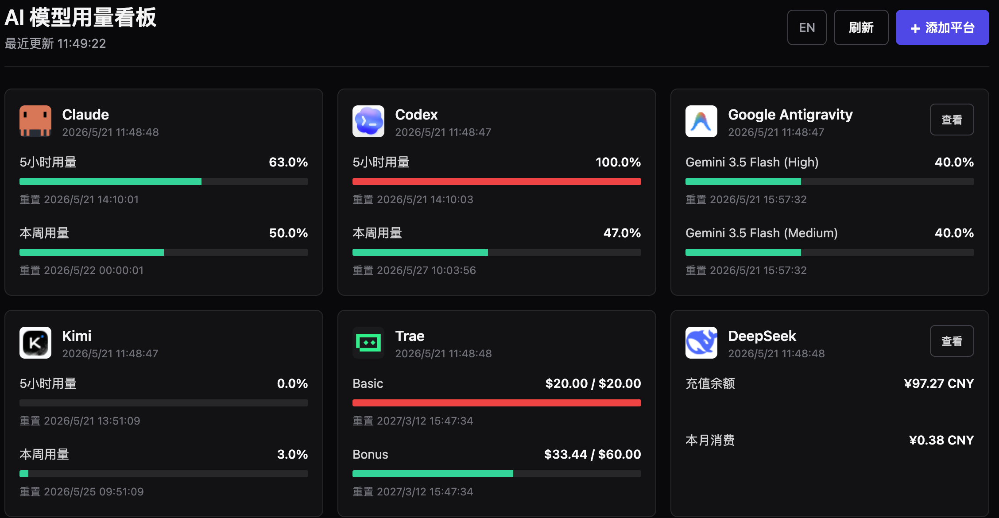

# AI Usage Monitor

> **仅支持 macOS** · [English README](README.md)


本地 dashboard，聚合监控多个 AI 平台的用量（Claude、Trae、Kimi、MiniMax、DeepSeek、Codex、Google Antigravity、Antigravity IDE、Cursor、OpenRouter、硅基流动），每 30 秒自动刷新。

**为什么做这个：** 大多数 AI 平台把用量和额度信息散落在各自页面，同时订阅多个平台时频繁切换 Tab 查看限额非常麻烦。这个工具把所有平台汇总到一处，自动刷新，不需要任何 API Key。

认证方式：通过配套 Chrome 插件一键导出浏览器 Cookie 和 Auth Headers，**无需手动复制粘贴**。Codex、Google Antigravity、Antigravity IDE、Cursor 直接读取本地 App 数据，无需任何配置。OpenRouter 仅需填写 API Key。

---

## 截图



---

## 快速开始

### 第一步：安装服务端

```bash
git clone https://github.com/TomTong-1016/ai-usage-monitor.git
cd ai-usage-monitor
bash install.sh
```


### 第二步：启动

```bash
venv/bin/uvicorn server:app --host 127.0.0.1 --port 8765
```

打开浏览器访问 **http://localhost:8765**

---

### 第三步：在 Dashboard 中添加平台

启动后页面为空白状态，点击 **「+ 添加平台」** 按钮，从弹窗中选择你使用的平台：

**本地 App 类（Codex、Antigravity、Antigravity IDE、Cursor）**：点击「检测并启用」，服务端自动读取本地 App 数据，无需任何配置。

**API Key 类（OpenRouter）**：点击「配置」，在弹窗中填入 API Key 即可。

**需要 Chrome 插件的平台（Claude、Kimi、Trae、MiniMax、DeepSeek、硅基流动）**：向导会引导你完成以下步骤：

1. 安装 Chrome 插件（加载 `chrome-extension/` 目录为开发者扩展）
2. 在 Chrome 中登录对应平台，并访问向导中指定的页面（让插件在后台捕获 Auth Headers）
3. 点击插件图标 → 「导出 credentials.json」→ 将文件上传到向导中的上传区

上传后服务端自动写入凭据文件、检测并启用所有就绪的平台，无需执行任何命令。

---

## 支持的平台

| 平台 | 认证方式 | 需要插件？ | 刷新间隔 | 监控指标 |
|------|---------|-----------|---------|---------|
| Claude | Cookie + Auth Header | ✅ 需访问用量页 | 30 秒 | 5小时用量、本周用量 |
| Kimi | Cookie（kimi-auth） | ✅ 仅需登录 | 30 秒 | 5小时用量、本周用量 |
| Trae | Cookie + Auth Header | ✅ 需触发 API | 30 秒 | Basic 额度、Bonus 额度 |
| MiniMax | Cookie + Auth Header | ✅ 需触发 API | 2 分钟 | 剩余请求数 |
| DeepSeek | Cookie + Auth Header | ✅ 需触发 API | 2 分钟 | 账户余额、用量 |
| Codex | 本地 App 磁盘缓存 | ❌ 无需配置 | 30 秒 | 速率限制、Credits |
| Google Antigravity | 本地 Language Server | ❌ 无需配置 | 30 秒 | 模型可用状态 |
| Antigravity IDE | 本地 Language Server | ❌ 无需配置 | 30 秒 | AI Credits |
| Cursor | 本地 App | ❌ 无需配置 | 30 秒 | 套餐用量、On-demand 消费 |
| OpenRouter | API Key | ❌ 填写 API Key | 30 秒 | 账户余额、累计消费、累计充值 |
| 硅基流动 | Cookie + Auth Header | ✅ 需触发 API | 30 秒 | 账户余额、近1天/近1周用量 |

---

## 凭据安全说明

- `cookie/`、`header-txt/`、`config.json` 均在 `.gitignore` 中，**不会被提交到 git**
- 凭据仅存储在本地，服务端绑定 `127.0.0.1`，不对外网暴露
- Chrome 插件权限仅限于已声明的平台域名，不访问其他网站

---

## 更新凭据

Cookie 和 Auth Token 会定期过期。在 Dashboard 中直接点击平台卡片上的**刷新凭据**按钮，向导会引导你重新导出并上传 `credentials.json`，无需移除平台再重新添加。

也可以直接用命令行更新：

```bash
bash import-credentials.sh ~/Downloads/credentials.json
```

---

## 常见问题

**某平台显示"Cookie 已失效"**：Cookie 已过期，在 Chrome 中重新登录该平台，重新导出 credentials.json 后上传即可。

**DeepSeek 只捕获到 1/3 端点**：在 [platform.deepseek.com/usage](https://platform.deepseek.com/usage) 页面停留几秒，等待所有 API 请求完成后再导出。

**Trae 显示"Authorization 过期"**：Auth Token 比 Cookie 更易过期，重新访问 Trae 账户/用量页面，让插件捕获 entitlement 请求后重新导出即可。

**Codex 显示"未找到缓存"**：确认 Codex App 已安装并至少打开过一次，服务端自动读取 `~/Library/Application Support/Codex/` 下的本地缓存。

**Google Antigravity 显示"language server not found"**：确认 Antigravity App 正在运行，服务端通过本地端口连接其 Language Server。

---

## 目录结构

```
ai-usage-monitor/
├── chrome-extension/      # Chrome 插件源码
│   ├── manifest.json
│   ├── background.js      # 后台拦截 Auth Headers
│   ├── popup.html         # 插件弹窗 UI
│   ├── popup.js
│   └── icons/
├── cookie/                # Cookie 文件（gitignored，由插件导出）
├── header-txt/            # Auth Header 文件（gitignored，由插件导出）
├── request_overrides/     # 平台请求覆盖（gitignored）
├── config.json            # 用户配置（gitignored，含 claude_org_id 等）
├── config.json.example    # 配置模板
├── server.py              # FastAPI 服务端
├── fetcher.py             # 各平台 HTTP 抓取逻辑
├── parsers.py             # 响应解析
├── models.py              # 数据模型
├── dashboard/             # 前端静态文件
├── install.sh             # 一键安装脚本
└── import-credentials.sh  # 命令行导入凭据（Dashboard 上传的备用方案）
```

---

## 参与贡献

欢迎提交 PR！如果想增加对新平台的支持，主要修改 `fetcher.py`（HTTP 抓取逻辑）和 `parsers.py`（响应解析）。也可以先开 Issue 讨论方案。

---

## License

[MIT](LICENSE)
