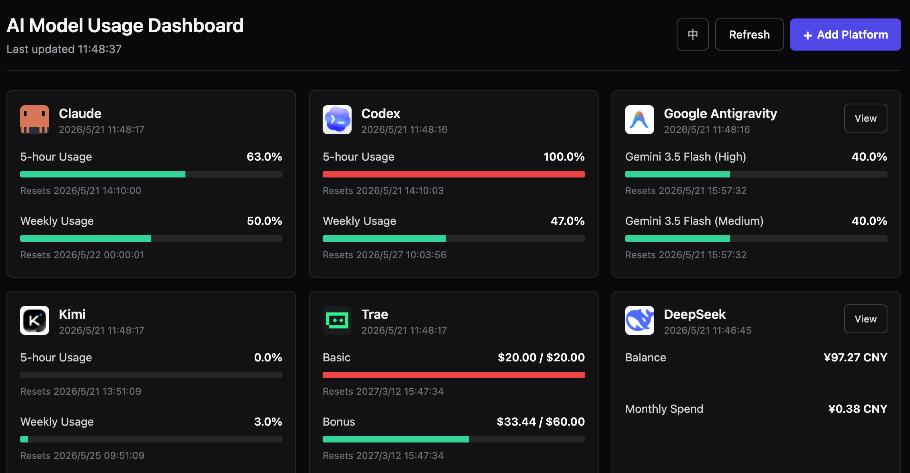

# AI Usage Monitor

> **macOS only** · [中文文档](README-zh.md)


A local dashboard that aggregates usage metrics from multiple AI platforms — Claude, Trae, Kimi, MiniMax, DeepSeek, Codex, and Google Antigravity — with automatic refresh every 30 seconds.

**Why this exists:** Most AI platforms bury their usage and quota data on separate pages. When you're juggling 5+ subscriptions, constantly switching tabs to check limits is tedious. This tool pulls everything into one place, refreshes automatically, and requires zero API keys.

Authentication is handled via a companion Chrome extension that exports browser cookies and auth headers in one click. **No manual copy-pasting. No API keys.** Codex and Google Antigravity read from local app data directly and require zero configuration.

---

## Screenshot



---

## Quick Start

### Step 1 — Install

```bash
git clone https://github.com/TomTong-1016/ai-usage-monitor.git
cd ai-usage-monitor
bash install.sh
```

> Replace `YOUR_USERNAME` with your actual GitHub username after you've pushed the repo.

### Step 2 — Start the server

```bash
venv/bin/uvicorn server:app --host 127.0.0.1 --port 8765
```

Open **http://localhost:8765** in your browser.

---

### Step 3 — Add platforms in the Dashboard

The page starts empty. Click **「+ 添加平台」** (Add Platform) and pick from the modal.

**Local App platforms (Codex, Antigravity)** — Click "Detect & Enable". The server reads data directly from the local app on disk. No configuration needed.

**Chrome extension platforms (Claude, Kimi, Trae, MiniMax, DeepSeek)** — The setup wizard walks you through:

1. Load `chrome-extension/` as an unpacked extension in Chrome (`chrome://extensions/` → Developer mode → Load unpacked)
2. Log in to the platform in Chrome and visit the page shown in the wizard (so the extension can capture Auth Headers in the background)
3. Click the extension icon → "Export credentials.json" → upload the file in the wizard

After upload the server writes all credential files, detects every ready platform, and enables them automatically — no terminal commands needed.

---

## Supported Platforms

| Platform | Auth method | Extension needed? | Refresh | Metrics |
|----------|------------|-------------------|---------|---------|
| Claude | Cookie + Auth Header | ✅ Visit usage page | 30 s | 5-hour usage, weekly usage |
| Kimi | Cookie (kimi-auth) | ✅ Login only | 30 s | 5-hour usage, weekly usage |
| Trae | Cookie + Auth Header | ✅ Trigger API | 30 s | Basic quota, Bonus quota |
| MiniMax | Cookie + Auth Header | ✅ Trigger API | 2 min | Remaining requests |
| DeepSeek | Cookie + Auth Header | ✅ Trigger API | 2 min | Balance, usage |
| Codex | Local app disk cache | ❌ None | 30 s | Rate limits, credits |
| Google Antigravity | Local Language Server | ❌ None | 30 s | Model availability |

---

## Security

- `cookie/`, `header-txt/`, and `config.json` are listed in `.gitignore` and will never be committed
- The server binds to `127.0.0.1` only — not exposed to the network
- The Chrome extension declares host permissions only for the platforms listed above

---

## Refreshing Expired Credentials

Cookies and auth tokens expire periodically. In the Dashboard, click the **refresh credentials** button directly on the platform card — the setup wizard will walk you through re-exporting and uploading a new `credentials.json` without removing the platform.

You can also refresh credentials from the command line:

```bash
bash import-credentials.sh ~/Downloads/credentials.json
```

---

## Troubleshooting

**"Cookie expired" error on a platform** — Log back in to that platform in Chrome, re-export `credentials.json`, and upload it again.

**DeepSeek shows only 1/3 endpoints captured** — Stay on [platform.deepseek.com/usage](https://platform.deepseek.com/usage) for a few seconds until all three API requests fire, then export.

**Trae shows "Authorization expired"** — The auth token expires faster than cookies. Re-visit the Trae account/usage page so the extension captures the entitlement request, then re-export.

**Codex shows "cache not found"** — Make sure the Codex App is installed and has been opened at least once so the local cache exists under `~/Library/Application Support/Codex/`.

**Antigravity shows "language server not found"** — Make sure the Antigravity App is running; the server connects to its local Language Server port.

---

## Directory Structure

```
ai-usage-monitor/
├── chrome-extension/      # Chrome extension source
│   ├── manifest.json
│   ├── background.js      # Service worker — intercepts auth headers
│   ├── popup.html         # Extension popup UI
│   ├── popup.js
│   └── icons/
├── cookie/                # Cookie files (gitignored — written by server on import)
├── header-txt/            # Auth header files (gitignored — written by server on import)
├── request_overrides/     # Per-platform request overrides (gitignored)
├── config.json            # User config (gitignored — contains claude_org_id, etc.)
├── config.json.example    # Config template
├── server.py              # FastAPI server
├── fetcher.py             # Per-platform HTTP fetch logic
├── parsers.py             # Response parsers → unified Metric structs
├── models.py              # Pydantic data models
├── dashboard/             # Frontend static files
├── install.sh             # One-command setup script
└── import-credentials.sh  # CLI alternative for importing credentials.json
```

---

## Contributing

Contributions are welcome! If you want to add support for a new platform, the main files to touch are `fetcher.py` (HTTP fetch logic) and `parsers.py` (response parsing). Feel free to open an issue first to discuss your idea.

---

## License

[MIT](LICENSE)
